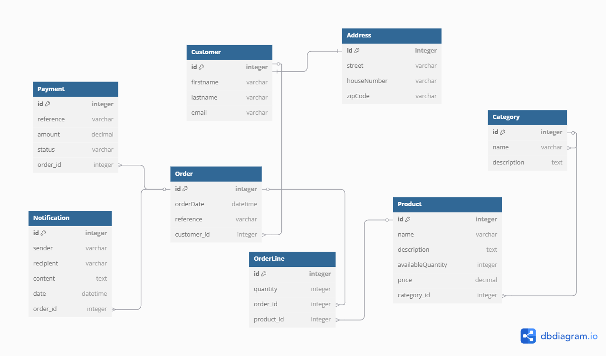

# E-Commerce Database Design Documentation

## Overview

This database design supports an e-commerce application that manages customers, products, orders, payments, and notifications. The schema is structured to handle the core business processes of an online store, including customer management, product categorization, order processing, payment tracking, and notification delivery.
 

## Domain Model

The system is organized into five primary domains:

### 1. Customer Domain

Manages all customer-related data and operations, including personal information and addresses.

### 2. Product Domain

Handles product information, inventory management, and categorization.

### 3. Order Domain

Manages the order lifecycle, from creation to fulfillment, including order lines.

### 4. Payment Domain

Handles all payment-related operations and statuses for orders.

### 5. Notification Domain

Manages communication with customers and internal stakeholders regarding order and payment events.

## Database Schema

### Entities and Relationships by Domain

#### Customer Domain

- Customer: Stores basic customer information including personal details and contact information.

- Address: Contains customer address details linked in a one-to-one relationship with the Customer entity.

#### Product Domain

- Category: Organizes products into logical groups with descriptive information.

- Product: Contains product details including name, description, inventory levels, and pricing. Each product belongs to a specific category.

#### Order Domain

- Order: Represents a customer purchase with order date and reference information. Each order is associated with a specific customer.

- OrderLine: Represents individual items within an order, specifying the product and quantity. This implements the many-to-many relationship between orders and products.

#### Payment Domain

- Payment: Tracks payment information for orders including reference numbers, amounts, and status. Each payment is linked to a specific order.

#### Notification Domain

- Notification: Manages communications related to orders, storing sender, recipient, content, and timestamp information. Each notification is associated with a specific order.

### Cross-Domain Relationships

- Customer-Order: Links the Customer and Order domains, allowing customers to place orders.

- Product-OrderLine: Connects the Product and Order domains, enabling products to be included in orders.

- Order-Payment: Bridges the Order and Payment domains, associating payments with specific orders.

- Order-Notification: Connects the Order and Notification domains, enabling order-related communications.

## Entity Details by Domain

### Customer Domain

#### Customer

- id: Unique identifier for the customer

- firstname: Customer's first name

- lastname: Customer's last name

- email: Customer's email address for communication

#### Address

- id: Unique identifier matching the customer ID

- street: Street name

- houseNumber: House or building number

- zipCode: Postal code for delivery

### Product Domain

#### Category

- id: Unique identifier for the category

- name: Category name

- description: Detailed description of the category

#### Product

- id: Unique identifier for the product

- name: Product name

- description: Detailed product description

- availableQuantity: Current inventory level

- price: Product price

- category_id: Foreign key linking to the Category table

### Order Domain

#### Order

- id: Unique identifier for the order

- orderDate: Date and time when the order was placed

- reference: Order reference number for tracking

- customer_id: Foreign key linking to the Customer table

#### OrderLine

- id: Unique identifier for the order line

- quantity: Number of product units ordered

- order_id: Foreign key linking to the Order table

- product_id: Foreign key linking to the Product table

### Payment Domain

#### Payment

- id: Unique identifier for the payment

- reference: Payment reference number

- amount: Payment amount

- status: Current payment status (e.g., pending, completed, failed)

- order_id: Foreign key linking to the Order table

### Notification Domain

#### Notification

- id: Unique identifier for the notification

- sender: Entity sending the notification

- recipient: Entity receiving the notification

- content: Notification message content

- date: Date and time when the notification was sent

- order_id: Foreign key linking to the Order table

## Domain Responsibilities

### Customer Domain

- Customer registration and profile management

- Address validation and management

- Customer authentication and authorization

### Product Domain

- Product catalog management

- Inventory tracking and updates

- Category organization and management

- Pricing management

### Order Domain

- Order creation and processing

- Order status tracking

- Order history management

- Shopping cart functionality

### Payment Domain

- Payment processing

- Payment status tracking

- Refund processing

- Payment method management

### Notification Domain

- Order confirmation notifications

- Shipping updates

- Payment confirmations

- Marketing communications

## Design Considerations

- Domain Isolation: Each domain has clear boundaries and responsibilities, allowing for independent development and scaling.

-  Data Integrity: Foreign key relationships ensure referential integrity across domains.

- Flexibility: The domain-based approach allows for future expansion of functionality within each domain.

- Scalability: Domains can be scaled independently based on load and usage patterns.

- Maintainability: Changes to one domain have minimal impact on other domains, improving system maintainability.

-  Security: Domain separation allows for more granular access control and security policies.

This domain-driven database design provides a solid foundation for an e-commerce application, supporting the core business processes while maintaining clear separation of concerns and allowing for future expansion.

