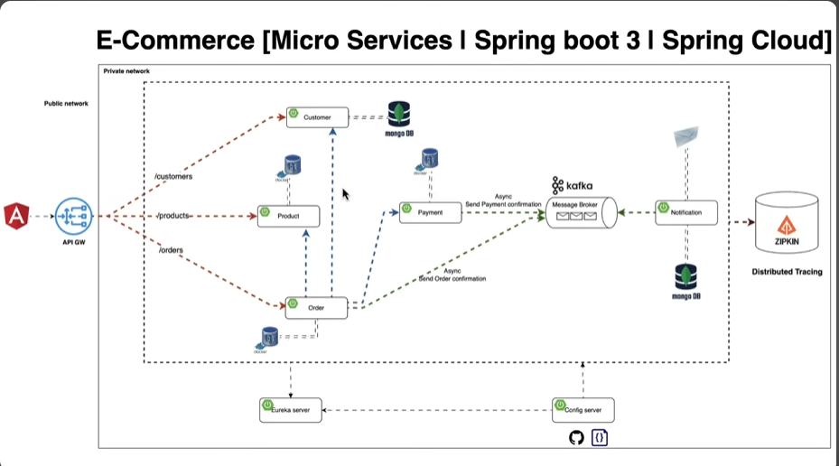

# E-Commerce Microservices Architecture Analysis

## Overview

The diagram illustrates a modern e-commerce system implemented using a microservices architecture with Spring Boot 3 and Spring Cloud. The system is divided into distinct services that communicate through various patterns, with clear separation between public and private networks.

## Key Components

### Core Microservices

-  Customer Service: Manages customer data and profiles

- Product Service: Handles product catalog and inventory

- Order Service: Processes and manages orders

- Payment Service: Handles payment processing

- Notification Service: Manages communication with customers

### Infrastructure Components

- API Gateway: Entrypoint for all client requests, routes to appropriate services

- DB Instances: MongoDB and PostgreSQL databases for each service (Customer, Product, Order)

- Kafka: Message broker for asynchronous communication

- Eureka Server: Service discovery and registration

- Config Server: Centralized configuration management

- Zipkin: Distributed tracing system

## Communication Patterns

### Synchronous Communication

- API Gateway to Services: Direct REST calls (shown as brown dashed arrows)

- Routes /customers to Customer Service

- Routes /products to Product Service

- Routes /orders to Order Service

### Asynchronous Communication

- Event-Driven Messaging via Kafka:

- Payment Service sends payment confirmation events

- Order Service sends order confirmation events

- Notification Service consumes events to trigger notifications

### Service-to-Service Communication

- Direct Service Calls: Blue dashed arrows show service dependencies

- Order Service communicates with Product Service to check inventory

- Order Service communicates with Customer Service to validate customer

- Payment Service communicates with Order Service to validate orders

## Network Architecture

- Public Network: Contains only the API Gateway, which is the entry point for external clients

- Private Network: Contains all microservices and infrastructure components, isolated from direct external access

## How It Works

- Request Flow:

- Client applications interact with the system through the API Gateway

- Gateway authenticates and routes requests to appropriate microservices

- Services process requests and may communicate with other services

- Order Processing Example:

- Client places order through API Gateway

- Gateway routes to Order Service

- Order Service validates with Customer Service

- Order Service checks inventory with Product Service

- Order Service creates order and publishes event to Kafka

- Payment Service receives event, processes payment

- Payment Service publishes payment confirmation event

- Notification Service receives event, sends confirmation to customer

- Infrastructure Support:

- Eureka Server enables services to find each other without hardcoded URLs

- Config Server provides centralized configuration management

- Zipkin traces requests across services for monitoring and debugging

## Technical Implementation

- Spring Boot 3: Framework for building the microservices

- Spring Cloud: Provides tools for common distributed system patterns

- MongoDB: NoSQL database for flexible data storage

- Kafka: Event streaming platform for asynchronous communication

- Docker/Containerization: Implied by the architecture for deployment

- Zipkin: Distributed tracing for observability

## Benefits of This Architecture

-  Scalability: Services can scale independently based on demand

- Resilience: Failure in one service doesn't bring down the entire system

- Technology Flexibility: Each service can use appropriate technologies

- Development Agility: Teams can work independently on different services

- Maintainability: Smaller, focused codebases are easier to maintain

- Security: API Gateway provides a single point for authentication/authorization